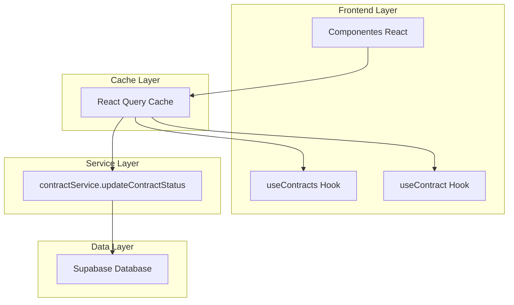
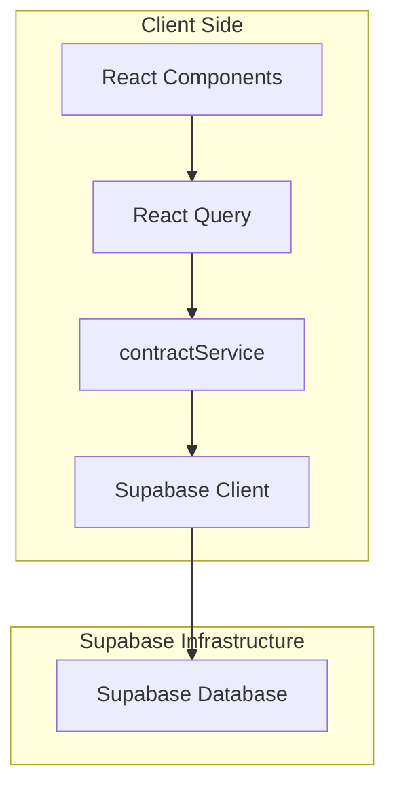
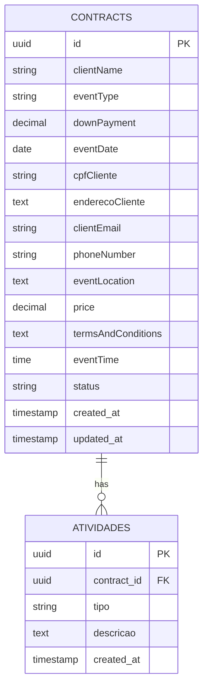

# Documentação de Arquitetura Técnica - Sistema de Sincronização de Status de Contratos

## 1. Design da Arquitetura



## 2. Descrição da Tecnologia
- Frontend: React@18 + TypeScript + React Query + Tailwind CSS
- Backend: Supabase (PostgreSQL + Auth + Real-time)
- Cache: React Query para sincronização automática
- Estado: Hooks existentes (useContracts, useContract)

## 3. Definições de Rotas
| Rota | Propósito |
|------|----------|
| /contratos | Lista de contratos com seletor de status em cada card |
| /contratos/detalhes/:id | Detalhes do contrato com componente de status editável |
| /cliente-contratos | Visualização dos contratos do cliente (somente leitura) |

## 4. Definições de API

### 4.1 API Principal

Atualização de status de contrato (função existente)
```typescript
contractService.updateContractStatus(contractId: string, status: ContractStatus)
```

Parâmetros:
| Nome do Parâmetro | Tipo | Obrigatório | Descrição |
|-------------------|------|-------------|----------|
| contractId | string | true | ID único do contrato |
| status | 'pendente' \| 'assinado' \| 'expirado' \| 'cancelado' | true | Novo status do contrato |

Resposta:
| Nome do Parâmetro | Tipo | Descrição |
|-------------------|------|----------|
| success | boolean | Status da operação |
| data | Contract | Dados atualizados do contrato |

Exemplo de uso:
```typescript
const result = await contractService.updateContractStatus('123', 'assinado');
```

### 4.2 Hooks de Sincronização

Hooks existentes que serão utilizados:
```typescript
// Para lista de contratos
const { data: contracts, refetch } = useContracts();

// Para contrato individual
const { data: contract, refetch } = useContract(contractId);
```

## 5. Arquitetura do Servidor


## 6. Modelo de Dados

### 6.1 Definição do Modelo de Dados


### 6.2 Linguagem de Definição de Dados

Tabela de Contratos (existente - não será modificada):
```sql
-- Estrutura existente da tabela contracts
-- Status possíveis: 'pendente', 'assinado', 'expirado', 'cancelado'
-- Campo status já existe e está configurado corretamente
```

Tabela de Atividades (existente - será utilizada para histórico):
```sql
-- Estrutura existente da tabela atividades
-- Será utilizada para registrar mudanças de status automaticamente
-- Trigger ou função será implementada para registrar mudanças
```

### 6.3 Tipos TypeScript

Tipos existentes que serão utilizados:
```typescript
// Tipo existente em contractService.ts
type ContractStatus = 'pendente' | 'assinado' | 'expirado' | 'cancelado';

// Interface existente
interface Contract {
  id: string;
  clientName: string;
  eventType: string;
  status: ContractStatus;
  // ... outros campos existentes
}
```

## 7. Estratégia de Implementação

### 7.1 Componentes a Modificar
1. **ContractList.tsx** - Adicionar seletor de status nos cards
2. **ContractStatus.tsx** - Adicionar funcionalidade de edição
3. **ClienteContratos.tsx** - Garantir sincronização automática

### 7.2 Sincronização via React Query
```typescript
// Estratégia de invalidação de cache
const updateStatus = async (contractId: string, newStatus: ContractStatus) => {
  await contractService.updateContractStatus(contractId, newStatus);
  
  // Invalidar cache para sincronização automática
  queryClient.invalidateQueries(['contracts']);
  queryClient.invalidateQueries(['contract', contractId]);
};
```

### 7.3 Registro de Histórico
```typescript
// Implementação automática via atividadeService existente
const logStatusChange = async (contractId: string, oldStatus: string, newStatus: string) => {
  await atividadeService.create({
    contract_id: contractId,
    tipo: 'status_change',
    descricao: `Status alterado de ${oldStatus} para ${newStatus}`
  });
};
```