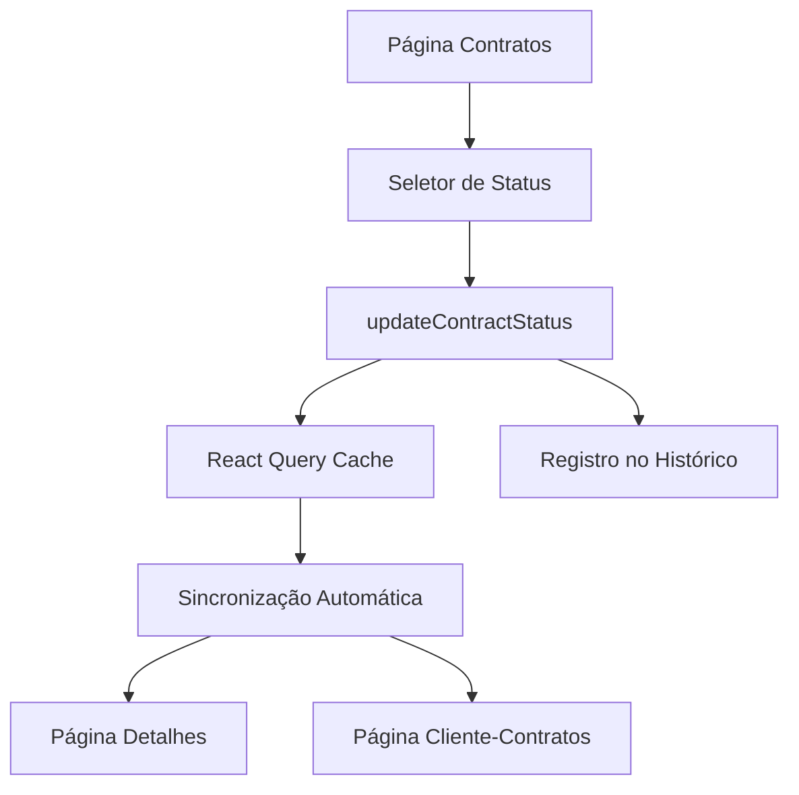

# Documentação de Requisitos - Sistema de Sincronização de Status de Contratos

## 1. Visão Geral do Produto
Sistema para permitir alteração manual de status de contratos e sincronização automática entre todas as páginas da aplicação. O sistema mantém consistência de dados em tempo real entre as rotas `/contratos`, `/contratos/detalhes` e `/cliente-contratos`, utilizando a infraestrutura existente sem modificar funcionalidades atuais.

## 2. Funcionalidades Principais

### 2.1 Papéis de Usuário
| Papel | Método de Acesso | Permissões Principais |
|-------|------------------|----------------------|
| Administrador | Login existente | Pode alterar status de qualquer contrato |
| Cliente | Acesso via link público | Visualiza apenas seus próprios contratos |

### 2.2 Módulo de Funcionalidades
Nossos requisitos consistem nas seguintes páginas principais:
1. **Página de Contratos** (/contratos): lista de contratos com cards individuais, abas de filtro por status
2. **Página de Detalhes** (/contratos/detalhes): visualização completa do contrato com componente de status
3. **Página Cliente-Contratos** (/cliente-contratos): visualização dos contratos do cliente com cards individuais

### 2.3 Detalhes das Páginas
| Nome da Página | Nome do Módulo | Descrição da Funcionalidade |
|----------------|----------------|-----------------------------|
| Contratos | Seletor de Status | Adicionar dropdown/select para alterar status diretamente no card do contrato |
| Contratos | Sincronização de Abas | Atualizar contadores e filtros das abas automaticamente quando status muda |
| Detalhes do Contrato | Componente de Status | Permitir alteração de status no componente ContractStatus existente |
| Detalhes do Contrato | Histórico de Atividades | Registrar automaticamente mudanças de status no histórico |
| Cliente-Contratos | Cards de Status | Sincronizar status dos cards automaticamente com mudanças do admin |

## 3. Processo Principal
**Fluxo do Administrador:**
1. Acessa lista de contratos em /contratos
2. Seleciona novo status no dropdown do card
3. Sistema atualiza status no banco via updateContractStatus
4. React Query invalida cache e recarrega dados
5. Todas as páginas são sincronizadas automaticamente
6. Histórico de atividade é registrado automaticamente

**Fluxo do Cliente:**
1. Acessa seus contratos em /cliente-contratos
2. Visualiza status atualizado em tempo real
3. Não pode alterar status (apenas visualização)

## 4. Design da Interface
### 4.1 Estilo de Design
- Cores primárias: Manter paleta existente do sistema
- Estilo de botão: Seguir padrão atual (rounded)
- Fonte: Manter tipografia existente
- Layout: Integrar harmoniosamente com cards existentes
- Ícones: Utilizar ícones já em uso (Clock, Check, X)

### 4.2 Visão Geral do Design das Páginas
| Nome da Página | Nome do Módulo | Elementos da UI |
|----------------|----------------|----------------|
| Contratos | Seletor de Status | Dropdown compacto no card, cores consistentes com status atual, transições suaves |
| Detalhes | Componente Status | Botão/dropdown integrado ao componente existente, mantendo layout atual |
| Cliente-Contratos | Indicador Status | Badges coloridos atualizados automaticamente, sem controles de edição |

### 4.3 Responsividade
O sistema é desktop-first com adaptação mobile, mantendo a responsividade existente dos componentes atuais.