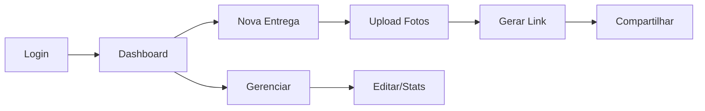
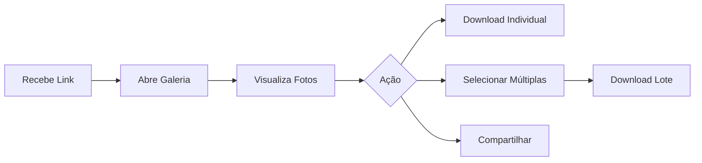

# PRD - Sistema de Entrega de Fotos Profissional

## 1. VISÃO EXECUTIVA

### 1.1 Objetivo Principal
Desenvolver um sistema de entrega de fotos profissional que permita aos fotógrafos compartilhar galerias de imagens com seus clientes através de links únicos, oferecendo uma experiência premium de visualização e download.

### 1.2 Proposta de Valor
- **Para Fotógrafos**: Sistema simples e profissional para entregar trabalhos sem depender de plataformas externas
- **Para Clientes**: Acesso fácil e intuitivo às fotos, com download individual ou em lote, sem necessidade de cadastro

### 1.3 Métricas de Sucesso
- Taxa de conversão de visualização para download > 80%
- Tempo médio de carregamento da galeria < 2 segundos
- NPS dos fotógrafos > 8
- Zero reclamações sobre dificuldade de uso por clientes finais

## 2. ARQUITETURA DO SISTEMA

### 2.1 Stack Tecnológica
- **Frontend**: Next.js (App Router) + TypeScript
- **Estilização**: Tailwind CSS (mantendo consistência com o site existente)
- **Backend**: Supabase (Auth, Database, Storage, Functions)
- **CDN**: Cloudflare/Vercel para otimização de imagens
- **Componentes**: shadcn/ui para UI consistente
- **Ícones**: Lucide React

### 2.2 Estrutura de URLs
```
/entrega-fotos                    → Dashboard do fotógrafo (protegido)
/entrega-fotos/nova               → Criar nova entrega (protegido)
/entrega-fotos/[codigo-unico]     → Galeria pública
/entrega-fotos/admin/[id]         → Gerenciar entrega específica (protegido)
```

### 2.3 Estrutura de Armazenamento (Supabase Storage)
```
fotografos/
  [fotografo-id]/
    entregas/
      [entrega-id]/
        originais/
          [nome-arquivo-original]
        thumbnails/
          [nome-arquivo-thumb]
        previews/
          [nome-arquivo-preview]
```

## 3. FUNCIONALIDADES DETALHADAS

### 3.1 Área do Fotógrafo (Autenticada)

#### 3.1.1 Dashboard Principal
- **Lista de Entregas**: Cards com preview, título, cliente, data, status
- **Filtros**: Por status (ativa/inativa), cliente, data
- **Busca**: Por nome do cliente ou código da entrega
- **Ações Rápidas**: Copiar link, editar, desativar
- **Métricas**: Visualizações, downloads totais, fotos mais baixadas

#### 3.1.2 Criar Nova Entrega
**Formulário em Steps:**

**Step 1 - Informações Básicas:**
- Título da entrega (obrigatório)
- Nome do cliente (obrigatório)
- Email do cliente (opcional - para notificações futuras)
- Telefone do cliente (opcional)
- Data do evento (opcional)
- Descrição/Observações (opcional)
- Validade do link (opcional - padrão: sem expiração)

**Step 2 - Upload de Fotos:**
- Drag & drop area com preview instantâneo
- Upload múltiplo (aceitar JPG, PNG, WebP)
- Barra de progresso individual e total
- Validação de tamanho (máx 50MB por arquivo)
- Geração automática de thumbnails no frontend
- Opção de adicionar alt text para cada imagem
- Reordenação por drag & drop

**Step 3 - Revisão e Publicação:**
- Preview da galeria como o cliente verá
- Código único gerado automaticamente
- Opção de personalizar o código (verificação de disponibilidade)
- Botão "Publicar Entrega"

#### 3.1.3 Gerenciar Entrega Existente
- Adicionar/remover fotos
- Alterar ordem das fotos
- Editar informações da entrega
- Ver estatísticas detalhadas (downloads por foto)
- Desativar/reativar entrega
- Alterar data de validade

### 3.2 Área Pública (Galeria do Cliente)

#### 3.2.1 Layout da Galeria
```typescript
interface GaleriaLayout {
  mobile: {
    colunas: 1 | 2,
    espacamento: '8px',
    thumbnailQualidade: 'média'
  },
  tablet: {
    colunas: 3,
    espacamento: '12px',
    thumbnailQualidade: 'alta'
  },
  desktop: {
    colunas: 4 | 5,
    espacamento: '16px',
    thumbnailQualidade: 'alta'
  }
}
```

#### 3.2.2 Componentes da Página
**Header:**
- Logo/nome do fotógrafo
- Título da entrega
- Data do evento (se disponível)
- Contador de fotos

**Galeria Principal:**
- Grid responsivo com aspect ratio preservado
- Lazy loading com skeleton placeholders
- Hover effects suaves (zoom sutil + overlay)
- Indicador de carregamento por imagem

**Lightbox (ao clicar na imagem):**
- Navegação por setas/swipe
- Zoom in/out
- Informações EXIF (opcional)
- Botão de download prominente
- Compartilhamento direto (WhatsApp, email)
- Contador (foto X de Y)

**Barra de Ações Fixa (bottom mobile, top desktop):**
- Botão "Baixar Selecionadas" (com contador)
- Botão "Baixar Todas"
- Modo seleção múltipla
- Filtros (se > 50 fotos)

### 3.3 Sistema de Download

#### 3.3.1 Download Individual
- Click direto no botão download
- Mantém nome original do arquivo
- Sem compressão adicional

#### 3.3.2 Download Múltiplo/Lote
```javascript
// Estratégia de download em lote
interface DownloadStrategy {
  pequeno: { // < 10 fotos
    metodo: 'download-sequencial',
    feedback: 'progress-bar'
  },
  medio: { // 10-50 fotos
    metodo: 'zip-client-side',
    biblioteca: 'jszip',
    feedback: 'modal-progress'
  },
  grande: { // > 50 fotos
    metodo: 'email-link',
    processamento: 'background-job',
    feedback: 'notificacao-email'
  }
}
```

## 4. DESIGN SYSTEM

### 4.1 Componentes Reutilizáveis
```typescript
// Componentes principais a serem criados
components/
  entrega-fotos/
    GaleriaGrid.tsx        // Grid responsivo principal
    FotoCard.tsx           // Card individual com hover
    Lightbox.tsx           // Visualizador fullscreen
    UploadZone.tsx         // Área de drag & drop
    DownloadManager.tsx    // Gerenciador de downloads
    ShareButton.tsx        // Compartilhamento
    SelectionMode.tsx      // Modo seleção múltipla
    GaleriaHeader.tsx      // Header da galeria pública
    StatsCard.tsx          // Card de estatísticas
```

### 4.2 Tokens de Design
```css
/* Variáveis específicas do módulo */
--foto-border-radius: 8px;
--foto-shadow-hover: 0 8px 30px rgba(0,0,0,0.12);
--foto-overlay-gradient: linear-gradient(to bottom, transparent 60%, rgba(0,0,0,0.7));
--galeria-gap-mobile: 8px;
--galeria-gap-desktop: 16px;
--animation-duration: 200ms;
```

### 4.3 Estados Visuais
- **Loading**: Skeleton com shimmer effect
- **Error**: Mensagem amigável com retry
- **Empty**: Ilustração + mensagem
- **Success**: Toast notifications

## 5. EXPERIÊNCIA DO USUÁRIO (UX)

### 5.1 Fluxo do Fotógrafo


### 5.2 Fluxo do Cliente


### 5.3 Micro-interações
- Feedback visual ao hover/touch
- Animação suave ao carregar imagens
- Progress bar em uploads/downloads
- Haptic feedback em mobile (se suportado)
- Transições entre estados

## 6. PERFORMANCE

### 6.1 Otimizações de Imagem
```typescript
interface ImageOptimization {
  thumbnail: {
    formato: 'webp',
    qualidade: 80,
    dimensoes: { maxWidth: 400, maxHeight: 400 }
  },
  preview: {
    formato: 'webp',
    qualidade: 85,
    dimensoes: { maxWidth: 1200, maxHeight: 1200 }
  },
  original: {
    manterFormato: true,
    manterQualidade: true,
    manterMetadata: true
  }
}
```

### 6.2 Estratégias de Loading
- Lazy loading com Intersection Observer
- Preload de 3 próximas imagens no lightbox
- Service Worker para cache offline
- CDN com cache de borda

### 6.3 Metas de Performance
- LCP < 2.5s
- FID < 100ms
- CLS < 0.1
- Time to Interactive < 3s

## 7. SEGURANÇA

### 7.1 Proteção de Conteúdo
- URLs assinadas com expiração (Supabase Storage)
- Rate limiting por IP
- Proteção contra hotlinking
- Marca d'água opcional

### 7.2 Privacidade
- Links não indexáveis (robots.txt)
- Opção de senha para galerias sensíveis
- Logs de acesso para o fotógrafo
- LGPD compliance

## 8. ANALYTICS E MONITORAMENTO

### 8.1 Métricas a Coletar
- Visualizações únicas por entrega
- Taxa de download por foto
- Tempo médio na galeria
- Dispositivos mais usados
- Horários de pico de acesso

### 8.2 Dashboard de Analytics
- Gráficos de visualização temporal
- Heatmap de fotos mais populares
- Funil de conversão (view → download)
- Comparativo entre entregas

## 9. CASOS DE USO ESPECÍFICOS

### 9.1 Casamento (300+ fotos)
- Categorização por momento (preparação, cerimônia, festa)
- Filtros rápidos
- Download por categoria
- Destaque para fotos favoritas

### 9.2 Ensaio Fotográfico (50-100 fotos)
- Layout premium com fotos grandes
- Transições elegantes
- Foco em qualidade visual
- Compartilhamento social facilitado

### 9.3 Evento Corporativo (100-200 fotos)
- Opção de branding corporativo
- Download em alta resolução
- Relatório de uso para o cliente
- Integração com sistemas corporativos

## 10. IMPLEMENTAÇÃO PROGRESSIVA

### Fase 1 - MVP (2 semanas)
- [x] Estrutura de banco de dados
- [ ] Upload básico de fotos
- [ ] Galeria pública simples
- [ ] Download individual
- [ ] Autenticação fotógrafo

### Fase 2 - Melhorias Core (2 semanas)
- [ ] Download múltiplo
- [ ] Lightbox completo
- [ ] Dashboard com métricas básicas
- [ ] Otimização de imagens

### Fase 3 - Features Avançadas (3 semanas)
- [ ] Analytics detalhado
- [ ] Compartilhamento social
- [ ] Proteção por senha
- [ ] API para integrações

### Fase 4 - Polish (1 semana)
- [ ] Animações refinadas
- [ ] PWA support
- [ ] Testes A/B
- [ ] Documentação completa

## 11. PROMPT PARA LLM

```markdown
Crie um sistema completo de entrega de fotos profissional seguindo estas especificações:

CONTEXTO:
- Sistema web para fotógrafos entregarem fotos aos clientes via link único
- Rota base já existe: /entrega-fotos
- Usar Supabase (Auth, Database, Storage)
- Manter consistência visual com site existente
- Mobile-first, totalmente responsivo

REQUISITOS TÉCNICOS:
- Next.js com App Router e TypeScript
- Tailwind CSS para estilização
- shadcn/ui para componentes
- Lucide React para ícones
- Supabase para todo backend

ESTRUTURA DE BANCO (já criada):
- Tabela fotografos: dados do fotógrafo
- Tabela entregas: informações de cada entrega
- Tabela fotos_entrega: fotos individuais
- Tabela logs_download: analytics

FUNCIONALIDADES PRINCIPAIS:

1. ÁREA AUTENTICADA (/entrega-fotos):
   - Dashboard com lista de entregas
   - Métricas (views, downloads)
   - Criar nova entrega com upload múltiplo
   - Gerenciar entregas existentes

2. GALERIA PÚBLICA (/entrega-fotos/[codigo-unico]):
   - Grid responsivo de fotos (1-2 cols mobile, 4-5 desktop)
   - Lazy loading com placeholders
   - Lightbox ao clicar (navegação, zoom, download)
   - Download individual por foto
   - Download múltiplo selecionando fotos
   - Botão "Baixar Todas" com estratégia inteligente

3. UPLOAD DE FOTOS:
   - Drag & drop com preview
   - Progresso individual
   - Geração de thumbnails no cliente
   - Upload para Supabase Storage
   - Estrutura: fotografos/[id]/entregas/[id]/

4. SISTEMA DE DOWNLOAD:
   - Individual: download direto do arquivo
   - Múltiplo < 10: downloads sequenciais
   - Múltiplo 10-50: ZIP no cliente com JSZip
   - Múltiplo > 50: job assíncrono + email

5. COMPONENTES UI:
   - GaleriaGrid: grid responsivo com aspect ratio
   - FotoCard: card com hover effect e seleção
   - Lightbox: visualizador fullscreen
   - UploadZone: área de drag & drop
   - DownloadManager: gerencia downloads múltiplos

6. PERFORMANCE:
   - Imagens WebP otimizadas
   - CDN para assets
   - Lazy loading
   - Cache inteligente

7. UX/UI:
   - Animações suaves (200ms)
   - Feedback visual em todas ações
   - Loading states com skeleton
   - Toast notifications
   - Mobile gestures (swipe no lightbox)

EXEMPLO DE USO:
1. Fotógrafo faz login
2. Clica em "Nova Entrega"
3. Preenche dados do cliente
4. Arrasta 150 fotos do casamento
5. Sistema faz upload com progress
6. Gera link: /entrega-fotos/SILVA-202411-ABC123
7. Fotógrafo envia link ao cliente
8. Cliente abre no celular
9. Vê galeria bonita e responsiva
10. Baixa fotos favoritas ou todas de uma vez

IMPORTANTE:
- Código limpo e bem comentado
- Componentes reutilizáveis
- Tratamento de erros amigável
- Acessibilidade (ARIA labels)
- SEO otimizado para rota pública
```

## 12. CONSIDERAÇÕES FINAIS

Este PRD foi estruturado para fornecer uma visão completa do sistema, desde a arquitetura até os detalhes de implementação. O foco está em criar uma experiência premium tanto para fotógrafos quanto para seus clientes, com performance e usabilidade como prioridades.

A implementação progressiva permite entregas rápidas de valor enquanto o sistema evolui para sua versão completa.


Próximos passos:
🧠 Conectar ao Supabase: Substituir os dados falsos por dados reais.
🔐 Autenticação: Fazer o login do fotógrafo funcionar de verdade.
⬆️ Upload Real: Ativar a área de upload para enviar as fotos.
⬇️ Downloads: Implementar a lógica para baixar as imagens.
Por onde prefere começar? 🚀