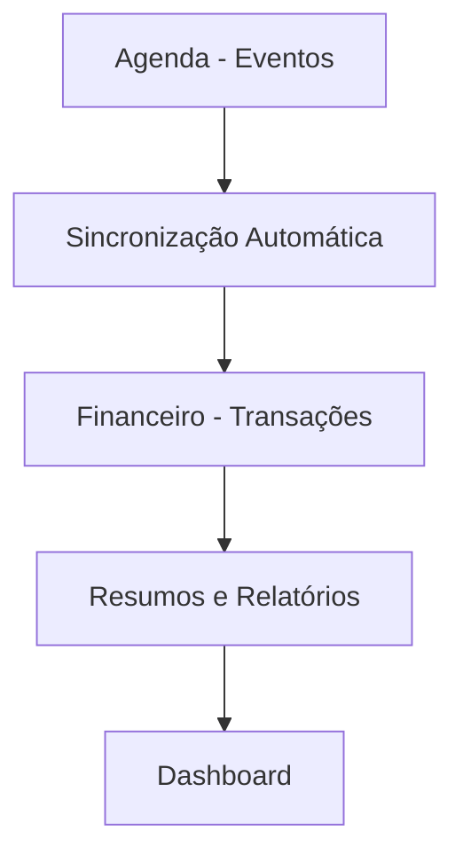

# 🗂️ BACKUP - Lógica e Dinâmica das Rotas Agenda e Financeiro

## 📋 Índice
1. [Visão Geral do Sistema](#visão-geral-do-sistema)
2. [Estrutura de Banco de Dados](#estrutura-de-banco-de-dados)
3. [Rota Agenda - Lógica Completa](#rota-agenda---lógica-completa)
4. [Rota Financeiro - Lógica Completa](#rota-financeiro---lógica-completa)
5. [Integração Agenda ↔ Financeiro](#integração-agenda--financeiro)
6. [Políticas RLS e Segurança](#políticas-rls-e-segurança)
7. [Migrações SQL Críticas](#migrações-sql-críticas)
8. [Fluxos de Dados](#fluxos-de-dados)

---

## 🎯 Visão Geral do Sistema

### Arquitetura Multi-usuário
- **Princípio**: Cada usuário vê apenas seus próprios dados
- **Implementação**: Campo `user_id` em todas as tabelas + Políticas RLS
- **Autenticação**: Supabase Auth (`auth.uid()`)

### Integração Principal


---

## 🗄️ Estrutura de Banco de Dados

### Tabelas Principais

#### 1. `agenda_eventos`
```sql
CREATE TABLE agenda_eventos (
    id UUID PRIMARY KEY DEFAULT uuid_generate_v4(),
    user_id UUID NOT NULL REFERENCES auth.users(id) ON DELETE CASCADE,
    titulo TEXT NOT NULL,
    data_inicio TIMESTAMPTZ NOT NULL,
    data_fim TIMESTAMPTZ NOT NULL,
    tipo TEXT,
    local TEXT,
    observacoes TEXT,
    telefone TEXT,
    status TEXT DEFAULT 'agendado',
    cor TEXT DEFAULT '#3c83f6',
    cliente_id UUID REFERENCES clientes(id),
    notificacao_enviada BOOLEAN DEFAULT false,
    descricao TEXT,
    valor_total NUMERIC DEFAULT 0,
    valor_entrada NUMERIC DEFAULT 0,
    valor_restante NUMERIC DEFAULT 0,
    criado_em TIMESTAMPTZ DEFAULT now(),
    atualizado_em TIMESTAMPTZ DEFAULT now()
);
```

#### 2. `financeiro_transacoes`
```sql
CREATE TABLE financeiro_transacoes (
    id UUID PRIMARY KEY DEFAULT uuid_generate_v4(),
    user_id UUID NOT NULL REFERENCES auth.users(id) ON DELETE CASCADE,
    evento_id UUID REFERENCES agenda_eventos(id) ON DELETE SET NULL,
    descricao TEXT NOT NULL,
    valor NUMERIC NOT NULL,
    tipo TEXT NOT NULL CHECK (tipo IN ('receita', 'despesa')),
    status TEXT NOT NULL CHECK (status IN ('pendente', 'recebido', 'entrada', 'restante')),
    data_transacao TIMESTAMPTZ NOT NULL,
    data_evento TIMESTAMPTZ,
    categoria TEXT,
    forma_pagamento TEXT,
    observacoes TEXT,
    clienteName TEXT,
    cliente_id UUID REFERENCES clientes(id),
    criado_em TIMESTAMPTZ DEFAULT now(),
    atualizado_em TIMESTAMPTZ DEFAULT now()
);
```

### Índices Essenciais
```sql
CREATE INDEX idx_agenda_user_data ON agenda_eventos(user_id, data_inicio);
CREATE INDEX idx_financeiro_user_tipo ON financeiro_transacoes(user_id, tipo, status);
CREATE INDEX idx_financeiro_evento ON financeiro_transacoes(evento_id);
```

---

## 📅 Rota Agenda - Lógica Completa

### Página Principal: `/agenda`
**Arquivo:** `src/pages/Dashboard/Agenda.tsx`

#### Funcionalidades Principais:
1. **Visualização em Calendário**
2. **CRUD de Eventos**
3. **Sincronização Financeira Automática**

#### Fluxo de Criação de Evento:
```typescript
// 1. Converter dados do formulário para Supabase
const eventoSupabase = converterParaSupabase(evento, userId);

// 2. Inserir evento na agenda
const { data: novoEvento } = await supabase
    .from('agenda_eventos')
    .insert([eventoSupabase])
    .select()
    .single();

// 3. Sincronizar dados financeiros automaticamente
await sincronizarEventoFinanceiro(novoEvento.id, userId);
```

### Service Principal: `src/services/agendaService.ts`

#### Funções Críticas:

##### 1. `criarEvento(evento, userId)`
- Valida dados de entrada
- Converte formato frontend → Supabase
- Cria transações financeiras automáticas
- Retorna evento criado

##### 2. `sincronizarEventoFinanceiro(eventoId, userId)`
- Busca evento na agenda
- Verifica transações existentes
- Cria/atualiza transação de entrada se necessário
- Cria/atualiza transação de valor restante se necessário

##### 3. `buscarEventos(userId)`
- Lista todos os eventos do usuário
- Aplica filtros por data/status
- Retorna formato frontend

---

## 💰 Rota Financeiro - Lógica Completa

### Página Principal: `/financeiro`
**Arquivo:** `src/pages/Dashboard/Financeiro.tsx`

#### Estrutura de Cards:
1. **Entradas** - Valores já recebidos (`status = 'entrada'`)
2. **A Receber** - Valores pendentes (`status = 'restante'`)
3. **Saídas** - Despesas (`tipo = 'despesa'`)
4. **Saldo** - Cálculo: (Entradas - Saídas)

#### Lógica de Cálculo dos Cards:
```typescript
// Card Entradas - SOMA transações regulares + cards da agenda
const totalEntradas = 
    (transactions || []).filter(t => t.tipo === 'receita' && t.status === 'entrada')
        .reduce((sum, t) => sum + t.valor, 0) +
    (transacoesEntradas || []).reduce((sum, t) => sum + t.valor, 0);

// Card A Receber - SOMA transações regulares + cards da agenda  
const totalAReceber =
    (transactions || []).filter(t => t.tipo === 'receita' && t.status === 'restante')
        .reduce((sum, t) => sum + t.valor, 0) +
    (transacoesRestantes || []).reduce((sum, t) => sum + t.valor, 0);
```

### Service Principal: `src/services/financeiroService.ts`

#### Funções Críticas:

##### 1. `buscarTransacoes(userId, filtros)`
- Lista transações com filtros
- Agrupa por mês/ano
- Aplica filtros de categoria/período

##### 2. `buscarResumoFinanceiro(userId)`
- Calcula totais de receitas/despesas
- Computa saldo atual
- Cache com React Query

---

## 🔄 Integração Agenda ↔ Financeiro

### Fluxo de Sincronização Automática:

#### 1. Quando um Evento é Criado:
```typescript
// No agendaService.ts - função criarEvento()
const novoEvento = await supabase.from('agenda_eventos').insert([eventoData]);

// Sincronização automática imediata
await sincronizarEventoFinanceiro(novoEvento.id, userId);
```

#### 2. Transações Criadas Automaticamente:
- **Se `valor_entrada > 0`**: Cria transação tipo='receita', status='entrada'
- **Se `valor_restante > 0`**: Cria transação tipo='receita', status='restante'

#### 3. Quando um Evento é Atualizado:
```typescript
// Re-sincronização automática após update
await sincronizarEventoFinanceiro(eventoId, userId);
```

### Cards Individuais da Agenda:
- **Fonte**: Função `buscarEventosComValoresRestantes()` e `buscarEventosComValoresEntradas()`
- **Exibição**: Aparecem como cards individuais no Financeiro
- **Integração**: Somados nos totais dos cards superiores

---

## 🔒 Políticas RLS e Segurança

### Política Base para Todas as Tabelas:
```sql
-- Habilitar RLS
ALTER TABLE [tabela] ENABLE ROW LEVEL SECURITY;

-- Política SELECT
CREATE POLICY "[tabela]_select_policy" ON [tabela]
FOR SELECT USING (auth.uid() = user_id);

-- Política INSERT  
CREATE POLICY "[tabela]_insert_policy" ON [tabela]
FOR INSERT WITH CHECK (auth.uid() = user_id);

-- Política UPDATE
CREATE POLICY "[tabela]_update_policy" ON [tabela] 
FOR UPDATE USING (auth.uid() = user_id);

-- Política DELETE
CREATE POLICY "[tabela]_delete_policy" ON [tabela]
FOR DELETE USING (auth.uid() = user_id);
```

### Políticas Específicas da Agenda:
```sql
-- agenda_eventos
CREATE POLICY "agenda_eventos_user_access" ON agenda_eventos
FOR ALL USING (auth.uid() = user_id) WITH CHECK (auth.uid() = user_id);
```

### Políticas Específicas do Financeiro:
```sql
-- financeiro_transacoes  
CREATE POLICY "financeiro_transacoes_user_access" ON financeiro_transacoes
FOR ALL USING (auth.uid() = user_id) WITH CHECK (auth.uid() = user_id);
```

---

## 📊 Migrações SQL Críticas

### 1. Migração Base - Criação das Tabelas
**Arquivo:** `20240321003000_create_tables.sql`

### 2. Migração de Segurança Crítica  
**Arquivo:** `20250607000000_fix_critical_rls_security.sql`
```sql
-- Correção de política permissiva perigosa
DROP POLICY IF EXISTS "Usuários autenticados podem inserir usuários" ON usuarios;

-- Política correta que só permite inserir dados próprios
CREATE POLICY "Usuários podem inserir apenas seus próprios dados" 
ON usuarios FOR INSERT WITH CHECK (auth.uid() = id);
```

### 3. Adição de Campos Financeiros na Agenda
```sql
-- Adicionar campos financeiros à agenda_eventos
ALTER TABLE agenda_eventos ADD COLUMN IF NOT EXISTS valor_total NUMERIC DEFAULT 0;
ALTER TABLE agenda_eventos ADD COLUMN IF NOT EXISTS valor_entrada NUMERIC DEFAULT 0;  
ALTER TABLE agenda_eventos ADD COLUMN IF NOT EXISTS valor_restante NUMERIC DEFAULT 0;
```

### 4. Adição de Relacionamento Evento
```sql
-- Adicionar campo evento_id às transações financeiras
ALTER TABLE financeiro_transacoes ADD COLUMN IF NOT EXISTS evento_id UUID;
ALTER TABLE financeiro_transacoes ADD CONSTRAINT fk_evento 
    FOREIGN KEY (evento_id) REFERENCES agenda_eventos(id) ON DELETE SET NULL;
```

---

## 🔄 Fluxos de Dados

### Fluxo 1: Criação de Evento com Valores
```
1. Usuário preenche formulário de evento
2. Sistema valida dados (datas, valores)  
3. Converte para formato Supabase
4. Insere na tabela agenda_eventos
5. Dispara sincronização financeira automática
6. Cria transação de entrada (se valor_entrada > 0)
7. Cria transação de restante (se valor_restante > 0)
8. Atualiza contexto financeiro
9. Recarrega dados no frontend
```

### Fluxo 2: Visualização do Financeiro
```
1. Usuário acessa /financeiro
2. Sistema busca transações regulares
3. Sistema busca cards individuais da agenda
4. Calcula totais dos cards superiores
5. Agrupa transações por mês/ano
6. Renderiza interface com dados atualizados
```

### Fluxo 3: Sincronização Automática
```
1. useAutoSync() detecta mudanças
2. Invalida cache do React Query
3. Recarrega dados automaticamente
4. Atualiza interface em tempo real
```

---

## 🛠️ Funções de Recuperação

### Em caso de inconsistência entre Agenda e Financeiro:

#### 1. Sincronização Manual de Todos os Eventos:
```typescript
await sincronizarTodosEventosFinanceiro(userId);
```

#### 2. Migração de Transações Existentes:
```typescript
await migrarTransacoesExistentes(userId);
```

#### 3. Verificação de Inconsistências:
```typescript
await verificarInconsistenciasEventosFinanceiros(userId);
```

---

## 📝 Notas Importantes

### Cuidados ao Modificar:
1. **Sempre testar sincronização** após mudanças na agenda
2. **Verificar cálculos dos cards** após alterações no financeiro
3. **Validar políticas RLS** após mudanças no banco
4. **Testar com múltiplos usuários** para garantir isolamento

### Monitoramento:
- **Logs detalhados** em todas as operações críticas
- **Console.log específicos** para debug de sincronização
- **Toast notifications** para feedback do usuário

### Performance:
- **React Query** para cache inteligente
- **Índices otimizados** para consultas por user_id
- **Atualização automática** a cada 5 segundos

---

**Data do Backup:** ${new Date().toLocaleDateString('pt-BR')}  
**Versão:** 1.0  
**Status:** ✅ Sistema Operacional 